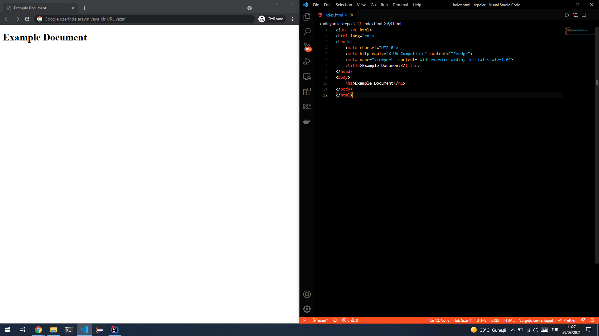

# kodluyoruzilkrepo
Bu repo [kodluyoruz](https://www.kodluyoruz.org/) front-end eğitiminde oluşturduğumuz ilk repo. İçerisinde bir adet README dosyası, bir adet de index.html barındırıyor.
## Installation 
Öncelikle projeyi clone'layın

```bash
git clone https://github.com/metetik/kodluyoruzilkrepo.git
```

## Usage
Projeyi clone'ladıktan sonra Visual Studio Code Programında açınız.

Linux için : 

```bash
cd kodluyoruzrepo
code .
```
## Preview

## Contributing
Pull request'ler kabul edilir. Büyük değişiklikler için lütfen önce neyi değiştirmek istediğinizi tartışmak için bir konu açınız

## License

[MIT](https://choosealicense.com/licenses/mit/)
